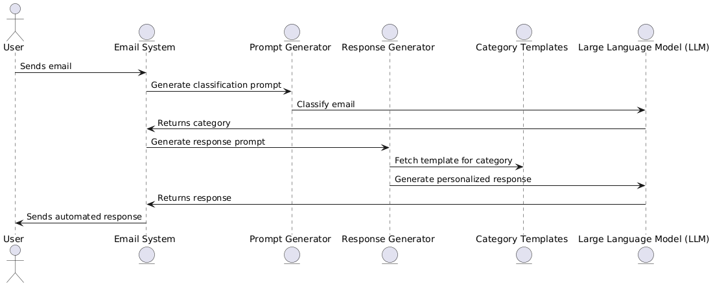

# Solution to LLM Integration Exercise: Email Classification and Automation

## Overview

In this repository, we provide a solution for automating email classification and response generation using a Large Language Model (LLM). The system processes incoming emails, categorizes them based on predefined labels, and generates personalized responses.

## Setup and Requirements

### Environment Setup

1. Create a new virtual environment:

```bash
python -m venv venv
source venv/bin/activate
```

2. Install required packages:

```bash
pip install -r requirements.txt
```

### Requirements File (requirements.txt)

```
openai>=1.3.0
pandas>=2.0.0
python-dotenv>=1.0.0
```

### Configuration

1. Create a `.env` file in your project root:

```
OPENAI_API_KEY=your_api_key_here
```

## Solution diagram

The following sequence diagram illustrates the process flow:



### **Process Flow:**

1. **User sends an email** → The **Email System** receives it.
2. **Email classification request** → The **Prompt Generator** creates a classification prompt.
3. **Email classification** → The **LLM** processes the prompt and assigns a category.
4. **Response generation request** → The **Prompt Generator** creates a response prompt based on the category.
5. **Template retrieval** → The **Response Generator** fetches the appropriate response template from **Category Templates**.
6. **Personalized response generation** → The **LLM** generates a customized response using the template.
7. **Automated response is sent** → The **User** receives the response.

## Results

### Performance Metrics

- **F1 Score: 0.8493**  
  The F1 Score represents the balance between **precision and recall**. A score of **0.8493 (84.93%)** indicates that the model has a strong ability to correctly classify emails while maintaining a balance between avoiding false positives and capturing true positives.

- **Precision: 0.8768**  
  Precision measures the proportion of correctly predicted email categories out of all the predictions made for that category. A precision of **87.68%** suggests that when the model assigns a classification, it is correct **most of the time**, minimizing false positives.

### Confusion matrix

The confusion matrix below provides a visual representation of how well the classification model performed in categorizing emails into different classes.


The confusion matrix shows that the model performs well in classifying most email categories, with high accuracy in "complaint," "feedback," and "support_request." However, some misclassifications occur, particularly between "inquiry" and "other" this could be improved by adjusting the classification prompt and adding more details of each class.

## Example run

| email_id | status    | classification | groundtruth | response_sent                                                                                                                                                                                                                                                                                                                                                                                                                                                                                                                                                                                                                                                                                                                                                                   |
| -------- | --------- | -------------- | ----------- | ------------------------------------------------------------------------------------------------------------------------------------------------------------------------------------------------------------------------------------------------------------------------------------------------------------------------------------------------------------------------------------------------------------------------------------------------------------------------------------------------------------------------------------------------------------------------------------------------------------------------------------------------------------------------------------------------------------------------------------------------------------------------------- |
| 1        | SUCCEEDED | complaint      | complaint   | "Dear customer, Thank you for reaching out and sharing your concerns regarding your order #12345. I sincerely apologize for the inconvenience you have experienced with the damaged item. We take all complaints seriously and want to assure you that we are currently investigating the issue. Could you please provide more details about the damage to the item? This will help us expedite the resolution process and ensure that we address your concerns effectively. In the meantime, I have forwarded your case to our support team for further review. Once again, we apologize for the trouble and appreciate your patience as we work to resolve this matter. If you have any further questions or need assistance, feel free to contact us. Best regards, CadreAI" |
| 2        | SUCCEEDED | inquiry        | inquiry     | "Dear customer, Thank you for your inquiry regarding our premium package. I’m happy to provide you with the information you need. I can confirm that our premium package is fully compatible with Mac OS, ensuring a seamless experience for all our Mac users. If you have any specific features in mind or need assistance with the installation process, feel free to ask! If you need further clarification or have additional questions, don’t hesitate to reach out. We're here to assist! Best regards, CadreAI"                                                                                                                                                                                                                                                         |
| 3        | SUCCEEDED | feedback       | feedback    | "Dear customer, Thank you for taking the time to share your feedback with us. We greatly appreciate your insights and are glad to know that you had a positive experience with our support team, especially with Sarah. It's wonderful to hear that she went above and beyond to help resolve your issue. We are constantly striving to improve, and your feedback helps us in our efforts. If there’s anything more we can do for you, or if you have additional suggestions, please let us know. Thanks again for your support! Best regards, CadreAI"                                                                                                                                                                                                                        |

## Prompt Iteration.

- ### Clasification prompt:
  - Prompt #1
    ```python
    "Your task is to classify this email: "{email_body}" using these categories: "{categories_str}".
    ```
    This prompt worked in most cases but sometimes returned the answer with apostrophes. For example:
    ```python
    "'inquiry'"
    ```
  - Prompt #2
    ```python
    "Your task is to classify this email: "{email_body}" using these categories: "{categories_str}".
    Respond only with the category without quotation marks or apostrophes."
    ```
    To solve that problem we added the instuction "Respond only with the category without quotation marks or apostrophes." and it worked perfectly. The results were in this format:
    ```python
    "inquiry"
    ```
- ### Response prompt:

  For response prompt we use templates like the following:

  ```python
  def complaint_response() -> str:
    """Returns a response template for complaints."""
    return (
        "Dear customer,\n\n"
        "Thank you for reaching out and sharing your concerns. I sincerely apologize for the inconvenience you have experienced. "
        "We take all complaints seriously and want to assure you that we are currently investigating the issue.\n\n"
        "Could you please provide more details about [specific problem mentioned]? This will help us expedite the resolution process. "
        "In the meantime, I have forwarded your case to our support team for further review.\n\n"
        "Once again, we apologize for the trouble and appreciate your patience. If you have any further questions, feel free to contact us.\n\n"
        "Best regards,\nCadreAI"
    )
  ```

  - Promt #1

  ```python
  "Your task is to respond to this email: "{email_body}" using the following template: "{template}"."
  ```

  This prompt worked well but the responses were very simple. We wanned to provide a more personalized message according to the email body.

  - Promt #2

  ```python
  "Your task is to respond to this email: "{email_body}" using the following template: "{template}".Try to give a personalized message."
  ```

  This prompt worked well but in some cases it put the subject and the costumer name as a parameter. For example:

  ```python
  "Subject: Response to your complaint. Body: Dear [customer name],\n\nThank you for reaching out a..."
  ```

  We just wanned the email body and to provide a generic email because we dont have the cosutmer name.

  - Promt #3

  ```python
  "Your task is to respond to this email: "{email_body}" using the following template: "{template}".
  Try to give a personalized message.
  Follow these instructions:
  - Do not include the subject, just the body.
  - Always refer to the customer as 'Dear customer'."
  ```

  The instructions added fix the problem in the previous prompt giving us a correct response email like the folowing:

  ```python
  "Dear customer,\n\nThank you for reaching out a..."
  ```

# Improvements made

Implemented special handling for emails classified as 'other' to ensure appropriate processing and manual review when necessary.

Emails classified as "other" often do not fit into predefined categories such as complaints, inquiries, feedback, or support requests. These cases may include ambiguous messages, spam, or uncommon requests that the automated system cannot confidently categorize.

To manage this category effectively, we escalate the email for human review to ensure accurate processing and appropriate response:

```python
def _handle_other(self, email: Dict, response: str):
        send_standard_response(email["id"], response)
        send_to_human_review(email["id"], email["body"])
```

# Summary

- ## Design Decisions:
  - Used an LLM to classify emails and generate responses dynamically
  - Restrict classification to the following categories: complaint, inquiry, feedback, support_request, other.
  - Implemented predefined email response templates for each category to ensure consistency and professionalism.
  - Validated the model’s predictions against ground truth data to calculate precision, accuracy, and overall performance metrics.
  - Added a human review function for unclassified or ambiguous cases to ensure accuracy and handle edge cases effectively.
- ## Challenges Encountered:
  - Handling apostrophes in classification responses.
  - Generating personalized but structured responses.
  - Avoiding unnecessary details like customer names when unavailable.
- ## Potential Improvements:
  - Add more categories and provide detailed descriptions for each one to enhance classification accuracy and improve response relevance
  - Include additional metadata in the responses to enhance personalization and provide more contextually relevant replies. For example customer name, email history, etc.
  - Implement logging and analytics for tracking model performance over time.
- ## Production Considerations
  - Monitor real-world performance to identify areas for optimization and enhance production efficiency.
  - Ensure API rate limits and cost management for LLM queries.
  - Implement caching for frequently requested email categories.
  - Secure environment variables and sensitive data handling.
